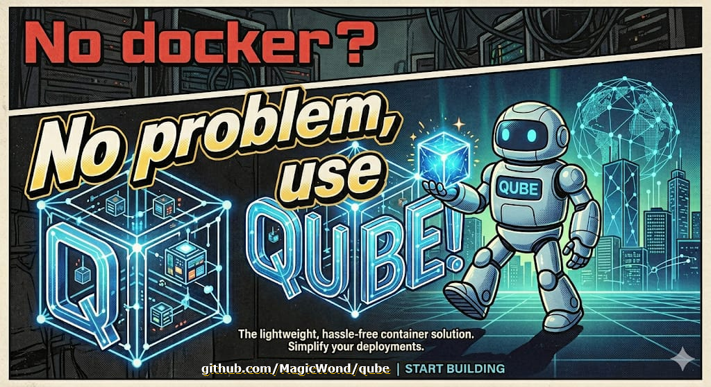

# Qube



Qube is a pure‑Rust tool that runs Docker images as QEMU virtual machines. It works on Windows, macOS, Linux, WSL2, and Android (Termux) without requiring a Docker daemon. Qube pulls a Docker image, extracts a root filesystem, and boots it in QEMU with options tailored to your host.

## Intro

- You just need Qemu and qube binary, thats it. you have a VM, that runs as a process on your host.
- Qubes with simple defaults that run: 1 CPU + 1G RAM + 8G Drive
- The Qubes you create truly portable. All files are stored in ./storage directory, and you can carry with you what you need.
- No need for root, or elevated priviledges. No root? No Admin? not a problem!
- Use --accel to speed up your qube !!!
- Qube inside Qube ? oh yeah!
- Multi OS, multi arch ? oh yeah!
- One simple step to Run? oh yeah!
- be patient, let things build and run... Love Qube!s
  - hint: first setup always takes longer (8G disk partitioning and checks), then qube start should be quick... if not, increase cpu/ram, start again...

```bash
# user@host~$   # any current directory
└── storage
    ├── containers
    │   └── <qube_id>
    └── images
        ├── alpine
        │   └── latest
        └── nginx
            └── latest
```

## Features
- Supports Windows (WSL2), Linux, MacOs and Android (Termux).
- Mostly tested running 'alpine:latest' and 'nginx:latest' on arm and x86 architectures.
- Pull any Docker image (`qube pull <image>`), extracting it into `storage/images/`.
- Run a pulled image as a VM (`qube run <image>`), creating a container under `storage/containers/`.
- Support for arm64 and amd64 architectures (expandable).
- Optional ISO CD‑ROM (`--iso` or `-s/--setup` to use the image's ISO).
- Kernel‑mode boot (`-k/--kernel`) with custom kernel, initrd, and kernel command line (`--append`).
- Port forwarding (`-p host:guest`) and memory/CPU configuration.
- Background (detached) execution and verbose QEMU command display.
- Commands to exec inside a VM, attach via SSH, view logs, list containers and images, stop/start/restart containers, and remove containers or images.

## Known Issues
- When running QEMU on Windows (WSL2) using terminal (qemu serial), characters may be displayed as pink, we have implemented a clear-text to white, during Vm qube-init, to avoid this use the gui video mode by running `qube run <image> -vga` or `qube run <image> --vga`, then you setup your sshd and connect via ssh. After qube starts, init runs a fix reset the terminal color back to white.
- Qube ps still needs to be better developped to show real VM states, for now its not working properly, it will show up but it just shows stopped or running once the PID is saved, which will only occus when starting our Qubes in mode: -d/--detach .
- Qube exec still needs to be implemented, for now its not working, the idea is to use the same mechanism as 'docker exec' to execute a command inside the VM.
- Qube attach uses qemu socket file, which means that we need to start Qube in -d/--detach mode to be able to attach to it later.

## 🚀 Upcoming Features (Roadmap)

We are constantly working to improve this project. Here are the features planned for the next releases:

- [ ] **Qubefile** - Use a 'Qubefile' to define the VM configuration.
- [ ] **Volumes** - Use volumes to share data between the host and the guest.
- [ ] **Networking** - Support for networks and qemu networking to share data between qubes and other hosts.
- [ ] **Snapshots** - Use Qemu snapshots to save the state of the VM.
- [ ] **Cloud Images** - Add support for cloud images: azure, ec2, generic, genericcloud, nocloud, raspi, etc.
- [ ] **Support more OS distros** - Develop and add support for more OS distros like Debian, Ubuntu, Fedora, CentOS, etc.
- [ ] **Support more Qemu targets** - Develop and add support for more Qemu targets like RISCV, MIPS, PPC, etc.
- [ ] **Support more Qemu machine types** - Develop and add support for more Qemu machine types.
- [ ] **Qube CLI** - Improve the Qube CLI commands.
- [ ] **Qube Documentation** - Create comprehensive documentation for Qube.
- [ ] **Qube Tests** - Add comprehensive tests for Qube.

## Quick Start

```bash
# Install Qemu - Linux or WSL2
apt install qemu-system qemu-utils
# Install Qemu - MacOs
brew install qemu
# Install Qemu - Windows
choco install qemu
# Install Qemu - Android (Termux)
pkg install qemu-utils
```

### Pull an image

```bash
qube pull nginx:latest
or
qube pull alpine:latest
# all files will get saved in: ./storage
```

### Run/Build a container

```bash
qube run alpine:latest
# or
qube run alpine:latest -vga # if serial is not showing output in your host or you want to use the gui video to setup the OS
# or
qube run nginx:latest -p 8080:80 # this will add to the default ssh port 2222:22, the port 8080:80
qube run nginx:latest -p 2223:22 -p 8080:80 # if you need to change the 2222:22 default ssh port (if already in use by another qube)

# IMPORTANT: 
# - Everytime you do 'qube run' you are creating a new qube (VM / container).
# - The first time you run a new image, qube will ask if you want to first do a "pull" for the image.
# - If you want to reuse the same qube, you need to use 'qube start' instead.
# - Don't run/start two default qubes at the same time, use ex:'-p 2223:22' to setup different ssh port mappings for each qube.
#
#        Qube1:  qube run alpine:latest
#        Qube2:  qube run alpine:latest -p 2223:22
#        Qube3:  qube run alpine:latest -p 2224:22
#        etc... until 2229:22
```

# Alpine needs iso installer, therefore needs to be setup
```bash
setup-alpine
# (follow the setup instructions to setup networking, install ssh server, format the disk, etc...)

# to poweroff run:
poweroff
```

# Nginx
```bash
/etc/init.d/nginx start
# to poweroff run:
poweroff -f
```

### list all containers

```bash
qube ps
```

The command prints a container ID. To start the container:

```bash
qube start <CONTAINER_ID>
qube start <CONTAINER_ID> -vga # if serial is not showing output in your host or you want to use the gui video to setup the OS
```

### Connect via SSH (may require sshd setup and install)

```bash
ssh -p 2222 root@localhost
```

### Execute a command inside the VM (-work in progress-)

```bash
qube exec <CONTAINER_ID> -- ls -l /etc
```

### View logs

```bash
qube logs <CONTAINER_ID>
```

### List containers and images

```bash
qube ps        # containers
qube images    # pulled images
```

### Remove resources

```bash
# Remove a container
qube rm <CONTAINER_ID>
# Remove an image
qube rmi alpine:latest
# Easy full clean-up
rm -fR ./storage
```

## Command Reference

| Command | Description |
|---------|-------------|
| `pull <image>` | Pull a Docker image and extract it to a bootable disk. Options: `-a/--arch <arm64\|amd64>` (default: host arch), `-M/--machine <type>` (e.g. q35, virt), `--disk-size <size>` (default: 8G), `-v/--verbose` |
| `run <image>` | Build and run a pulled image as a new QEMU VM. Options: `-a/--arch <arm64\|amd64>`, `-M/--machine <type>`, `-p/--port <host:guest>` (repeatable, default: 2222:22), `--iso <path>`, `-s/--setup` (boot from stored ISO), `-d/--detach`, `-v/--verbose`, `--accel <kvm\|hvf\|tcg>`, `-k/--kernel <path>`, `--initrd <path>`, `--append <string>`, `-m/--memory <size>` (default: 1G), `-c/--cpus <n or topology>` (default: 1), `--cpu-type <type>` (default: max), `--vga <std\|cirrus\|vmware\|qxl\|xenfb\|tcx\|cg3\|virtio\|none>` (omit for -nographic; bare `--vga` defaults to std) |
| `exec <container> [cmd...]` | Execute a command inside a running VM. Omit `cmd` for an interactive shell. (work in progress) |
| `attach <container>` | Attach a serial console to a running container (must be running). |
| `ps` | List all containers with status, ports and IDs. Options: `-v/--verbose` (shows PID, mode, memory, CPUs) |
| `images` | List all pulled images stored under `storage/images/`. |
| `logs <container>` | Show log output for a container. Options: `-f/--follow` (stream output continuously) |
| `stop <container>` | Stop a running container (sends SIGKILL to the QEMU process). |
| `start <container>` | Start a stopped container (reuses saved settings by default). Options: `-p/--port <host:guest>`, `--iso <path>`, `-s/--setup`, `-d/--detach`, `-v/--verbose`, `--accel <type>`, `-k/--kernel <path>`, `--initrd <path>`, `--append <string>`, `-m/--memory <size>`, `-c/--cpus <n or topology>`, `--cpu-type <type>`, `--vga <std\|cirrus\|vmware\|qxl\|xenfb\|tcx\|cg3\|virtio\|none>` (omit to use saved VGA config or -nographic) |
| `restart <container>` | Stop then start a container using its previously saved settings. |
| `rm <id / all>` | Remove a container by ID, or `all` to remove every container (irreversible). |
| `rmi <name / all>` | Remove a pulled image by name, or `all` to remove every image (irreversible). |

## Storage Layout

- `storage/images/<image>/` – Extracted root filesystem and optional ISO.
- `storage/containers/<id>/` – Per‑container data: disk image, OVMF variables, logs, PID files.

## Tips & Pitfalls

- **Kernel mode** (`-k/--kernel`) disables the default pflash firmware configuration. Use this when you need to boot a custom kernel.
- **ISO mode** (`--iso` or `-s/--setup`) adds a CD‑ROM device **in addition** to pflash. Use `--setup` to automatically use the ISO cached during `pull`.
- Default SSH port inside the VM is `22`; expose it with `-p <host_port>:22`.
- When running detached (`--detach`), QEMU output is written to `storage/containers/<id>/log.txt`.
- Use `--verbose` to see the full QEMU command for debugging.

## License

See the `LICENSE.md` file for details.
